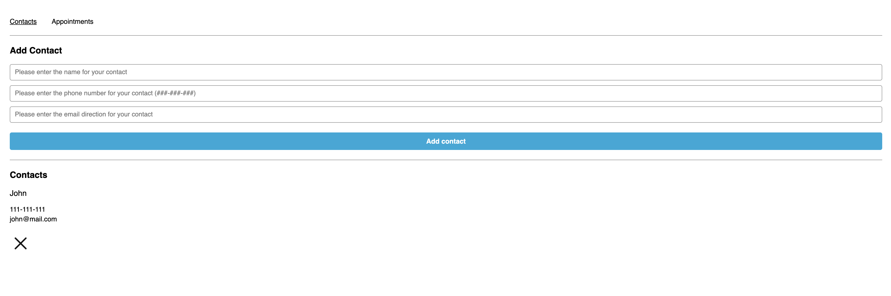

# Codecademy - React Challenge

This is a solution to the Codecademy React Challenge Project. If you want to run it on your own computer rather than on the netlify website listed below, you must use `npm start` (for the development build) or `npm run build` (for the production build). You can also use yarn (`yarn start` and `yarn run build`) if you prefer. This project is made using the React Router 5.2 version, and will probably be updated in a later release.

## Table of contents

  - [The challenge](#the-challenge)
  - [Screenshot](#screenshot)
  - [Links](#links)
- [My process](#my-process)
  - [Built with](#built-with)
  - [What I learned](#what-i-learned)
  - [Useful resources](#useful-resources)
- [Author](#author)

## Overview

The project was pretty easy to do for me, so I added a couple of features that weren't included in the original project, I list them below.

### The Project

** Original Requirements ** 
Users should be able to: 

- Save contacts
- See a warning when saving two contacts with the same name
- See Appointments
- Get different components rendered depending on the URL

** Added features ***
Users should be able to: 
 - View saved Contacts and Appointments after closing the page thanks to LocalStorage
 - 
 - Delete Contacts and Appointments

**Screenshot**

### Links

- Live Site URL: [View on Netlify](mateoreactchallenge.netlify.app)

### Built with

- HTML5 markup
- [React](https://reactjs.org/) - JS library
- [React Router](https://reactrouter.com/en/main)

### What I learned

I had very few difficulties when using React for this project, but I liked being able to use Window.sessionStorage to save forms when changing URLs, it took me a bit of time to find the way to include state in Window.localStorage but it made me more confident using both of these features.

### Useful resources

- [MDN - Mozilla Developer Network](https://developer.mozilla.org)

## Author

- Twitter - [@mateo_fain](https://www.twitter.com/mateo_fain)
- Dev.to - [@Chabulsqu](https://dev.to/chabulsqu)